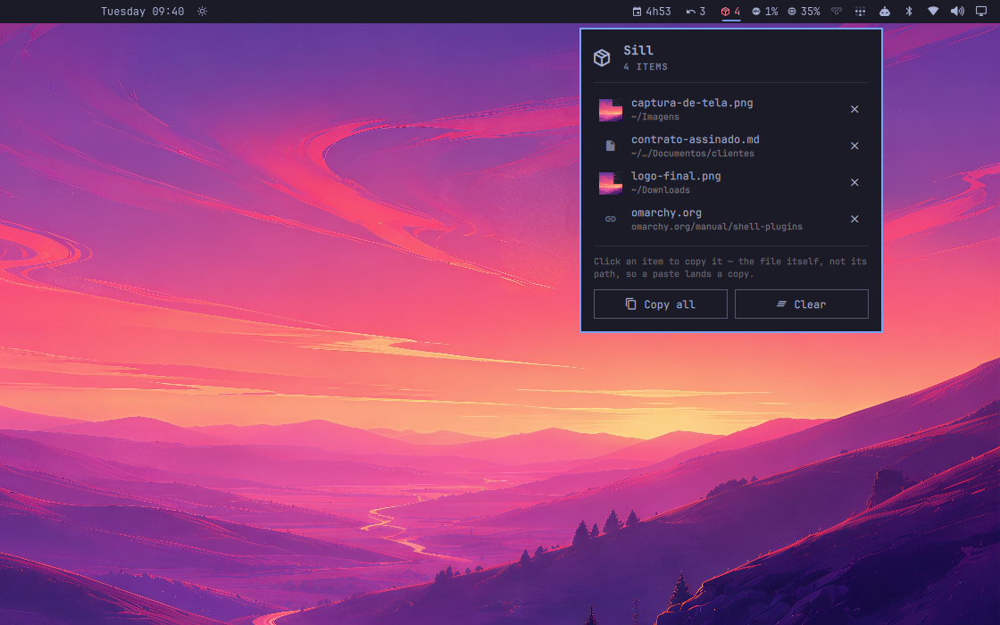

# Sill

A shelf on the bar. Drag a file onto it from anywhere, walk away to another
workspace, and copy it out where it belongs.



*Four things set down: two files, a link, and a line of text.*


The bar is the one surface a drag can always reach: it is on top of every
window, on every workspace. That is the whole idea.

## The problem it solves

Dragging a file from a folder on workspace 2 into a chat on workspace 5 is
not hard on Hyprland. It is impossible. You cannot switch workspaces with a
file held in your hand. So you copy it to a temporary folder, or you tile
both windows side by side and drag across the seam.

Sill gives you somewhere to put things down.

## Install

```bash
omarchy plugin add https://github.com/fernandomenolli/omarchy-sill.git --enable
```

Needs `wl-clipboard` (`wl-copy`), which Omarchy already installs.

## Remove

```bash
omarchy plugin remove io.github.fernandomenolli.sill
rm -rf ~/.local/state/omarchy/plugins/io.github.fernandomenolli.sill
```

## Using it


*The shelf in the bar, holding four.*

The icon is an outline while the shelf is empty and fills in when it is
holding something, with the count beside it. No colour changes: nothing on a
shelf is urgent, and red in this bar means something is the matter.

| Action | What happens |
|---|---|
| Drag a file onto the bar icon | it lands on the shelf; the panel opens so the whole panel becomes a target |
| Left click the icon | open the shelf |
| Right click the icon | copy every file on the shelf at once |
| Click a row | copy that one thing |
| Enter, with the shelf open | copy everything |
| × on a row | take it off the shelf |

**Copying a file copies the file, not its path.** It goes onto the clipboard
as `x-special/gnome-copied-files`, so `Ctrl+V` in a file manager, a file
dialog or a chat lands the file itself. Gathering five files from three
folders and pasting them in one go is the thing dragging could never do.

Links and lines of text can be dropped too, and they copy as text.

## What it does not do

**Nothing is moved or duplicated on disk.** The shelf holds references: a
path, a URL, a line of text. Clearing it never deletes anything.

A file you delete elsewhere says so. The shelf checks each path when you open
it, and one that is no longer there goes grey and reads *no longer there*
instead of its folder. Clicking it tells you rather than putting nothing on
the clipboard, and *Copy all* leaves it out. Finding this out at the moment
you paste, and getting silence, is the worst place to find it out.

**You cannot drag back out.** The reason is worth stating precisely, because
it is not the one you would guess. Wayland is fine with it: a plain
layer-shell surface can start a drag that a file manager accepts, verified
against the protocol trace.

What blocks it is the bar. Dragging a widget along the bar is how you reorder
it, so the bar owns the pointer across its whole strip and a press inside a
widget never reaches the widget. A drag cannot leave an open panel either: the
panel keeps a full-screen surface above everything to catch the click that
dismisses it, so a drag leaving the card lands on that instead of on the
window underneath.

So the way out is copying, which for the thing this is actually for beats
dragging anyway. Five files gathered from three folders is not a gesture
dragging can make.

## Settings

Open the panel and they are switches. Tapping one takes effect straight away
and is remembered in `~/.local/state/omarchy/plugins/io.github.fernandomenolli.sill/preferences.json`.

Omarchy has no settings screen, and the shell hands a plugin a copy of its
settings precisely so that changing them in place cannot leak back to disk. So
the panel keeps its own file rather than writing yours. If you would rather set
them in `~/.config/omarchy/shell.json`, a key on this widget's entry still
works and is what the switches start from:

```json
{
  "id": "io.github.fernandomenolli.sill",
  "showWhenIdle": false
}
```

Delete the preferences file and the panel goes back to whatever shell.json
says.

| Setting | Default | What it does |
|---|---|---|
| Open the shelf when a drag reaches the bar | on | gives you the whole panel to drop into |
| Empty the shelf after copying everything | off | for people who treat it as a one-way conveyor |
| Set a screenshot down as soon as it is taken | off | see below |
| Maximum items | 25 | the oldest fall off the end |

## Screenshots

Turn on *Set a screenshot down as soon as it is taken* and every screenshot
lands on the shelf as a file, next to whatever else is there.

A screenshot already goes to the clipboard, so one of them needs no help. The
case this serves is three of them for the same message: the clipboard holds
one thing, so by the time you take the third the first two are only files in
a folder, and gathering them again is the errand this exists to remove.

It costs nothing while nothing is happening. Hyprland announces a screenshot
as a screen capture, the same way it announces a call, and a capture that
starts and stops again immediately is somebody pressing the screenshot key.
Nothing watches a directory and no process is left running.

It is off by default, and deliberately so: everything else here arrives
because you put it there, and that promise is worth more than the
convenience. This is the one exception.

## What it costs

Measured on the machine this was built on, an AMD box with 24 cores running
Omarchy 4.0.0.alpha and Hyprland 0.56.2. The method is to read `utime + stime`
from `/proc/<pid>/stat` for the `omarchy-shell` process, with the plugin
enabled and then disabled, and take the difference. You can repeat it in four
lines of shell.

| | Shell alone | With this plugin |
|---|---|---|
| Idle, 30 seconds | 10 ms of CPU | 10 ms, no timer, nothing runs |
| 300 focus switches | 840 ms | 870 ms |
| Memory | ~500 MB | no measurable change |

The shell's own cost dominates everything here. **2.8 ms of that per focus
switch is Omarchy itself**: the bar redrawing, the active-window widget, the
workspace indicators. All five of these plugins together add 0.17 ms on top.

**It does not get heavier as it runs.** Nothing runs unless you drop something on it or click a row. A shelf holding twenty-five items costs exactly what an empty one costs, because nothing walks the list until you open the panel.

## Tests

```bash
node tests/run.js
```

No dependencies, no framework. They cover `model/`: parsing a drop into
items, deduplicating, and the labels each kind of item gets.

## Licence

MIT.
